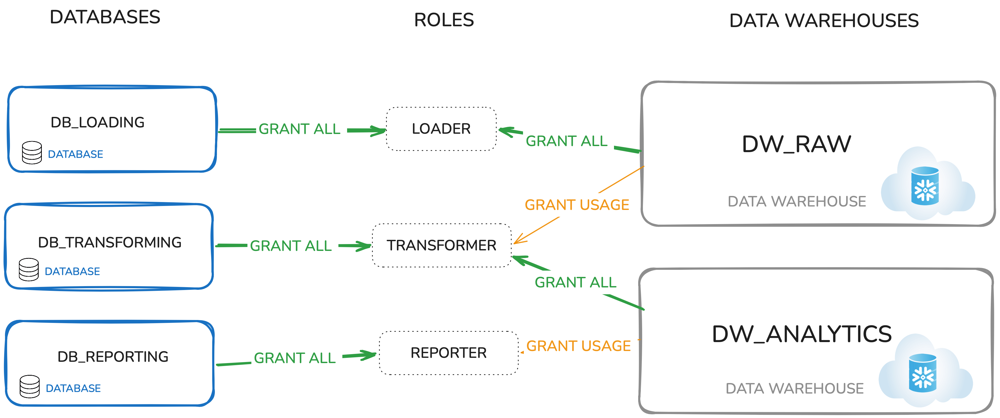

# DBT for Developers

Here is a custom design set up for dbt 

1. Set up Databases

~~~~sql
use role sysadmin;
create database raw;
create database analytics;
~~~~

2. Set up Warehouses 

Note: 3 warehouses for different purposes : 
* Loading 
* Transforming 
* Reporting 

~~~~sql 
create warehouse loading
    warehouse_size = xsmall
    auto_suspend = 3600
    auto_resume = false
    initially_suspended = true;

create warehouse transforming
    warehouse_size = xsmall
    auto_suspend = 60
    auto_resume = true
    initially_suspended = true;

create warehouse reporting
    warehouse_size = xsmall
    auto_suspend = 60
    auto_resume = true
    initially_suspended = true;
~~~~

3. Set up Roles & Warhouse permissions

Note: Role specified to each warehouse according

~~~~sql
use role securityadmin;

create role loader;
grant all on warehouse loading to role loader; 

create role transformer;
grant all on warehouse transforming to role transformer;

create role reporter;
grant all on warehouse reporting to role reporter;
~~~~

---

4. Users and Service accounts

Now EVERY user and Service account needs a separate user and the user needs tob e assigned to a role 


~~~~sql 
create user stitch_user -- or fivetran_user
    password = '_generate_this_'
    default_warehouse = loading
    default_role = loader; 

create user claire -- or amy, jeremy, etc.
    password = '_generate_this_'
    default_warehouse = transforming
    default_role = transformer
    must_change_password = true;

create user dbt_cloud_user
    password = '_generate_this_'
    default_warehouse = transforming
    default_role = transformer;

create user looker_user -- or mode_user etc.
    password = '_generate_this_'
    default_warehouse = reporting
    default_role = reporter;

-- then grant these roles to each user
grant role loader to user stitch_user; -- or fivetran_user
grant role transformer to user dbt_cloud_user;
grant role transformer to user claire; -- or amy, jeremy
grant role reporter to user looker_user; -- or mode_user, periscope_user
~~~~

---

5. Loader Role permissions 

~~~~sql
use role sysadmin;
grant all on database raw to role loader;
~~~~

6. Transformer Role permissions

We grant the transformer the power to read the raw data in the database raw AND future objects created from the database raw 

~~~~sql
grant usage on database raw to role transformer;
grant usage on future schemas in database raw to role transformer;
grant select on future tables in database raw to role transformer;
grant select on future views in database raw to role transformer;
~~~~

We also give access to any CURRENT objects in the raw database 


~~~~sql 
grant usage on all schemas in database raw to role transformer;
grant select on all tables in database raw to role transformer;
grant select on all views in database raw to role transformer;
~~~~

Lastly transformers need to be able to create in the analytics database 


~~~~sql 
grant all on database analytics to role transformer;
~~~~

---

7. Let Reporters read transformed data 

~~~~sql
grant usage on database analytics to role reporter;
grant usage on future schemas in database analytics to role reporter;
grant select on future tables in database analytics to role reporter;
grant select on future views in database analytics to role reporter;
~~~~

And any current objects 

~~~~sql
grant usage on all schemas in database analytics to role reporter;
grant select on all tables in database analytics to role reporter;
grant select on all views in database analytics to role reporter;
~~~~


In the end you should end up with something along the lines of : 




---

If once you click on Snowflake Workspace you only see the ```PUBLIC``` role then you have the minimal level of access

If you are a developer you may need the ```TRANSFORMATION``` role 

---

To access a dbt project (if utilising GitHub & Snowflake) you want to ensure you first : 

* Have Snowflake access with the right role 
* Can see your Org and Teams repository on your GitHub

Now in dbt select the following : 

* (Lower Left) Username >> Your Profile
* Scroll to linked account and connect them 

---

# DBT for Admins

Prerequisites: 
* Need access to Snowflake ```ACCOUNTADMIN``` role 
* Or BOTH ```SYSADMIN``` and ```SECURITYADMIN```


Raw databases are like the Bronze Layer. 

---

To modify different roles you can either adjust the top left hand corner or use 


~~~~sql
USE ROLE SYSADMIN
~~~~

We then create a Raw Database and a Target Database 


~~~~sql 
CREATE DATABASE raw -- usually a RAW data source is already created
CREATE DATABASE analytics_1
~~~~


Then we can set up a dedicated COMPUTE or warehouse for 

~~~~sql
CREATE DATAWAREHOUSE transform_wh
warehouse_size= small
auto_suspend = 60
auto_resume = true
initially_suspend = true
~~~~

For context : 

* auto_suspend - automatically shuts down a virtual warehouse after it stays idle 
* auto_resume - automatically starts up a suspended warehouse when a new SQL statement/query is applied to it 
* initially_suspend - when ````True```` warehouse is built in 'suspended' state and saves credits (if ```False``` the warehouse starts up and immediately consumes credits while idle )

---

Now use the security admin role to create a role 

~~~~sql
USE ROLE securityadmin;
CREATE ROLE transformer_1;
~~~~

Run similar privilges to the section in Developers for transfors (ensuring ```FULL USAGE``` permission on raw datawarehouse and ```ALL``` permissions on analytics datawarehouse )

Note: When dealing with shared databases you can import privileges 

~~~~sql
GRANT IMPORTED PRIVILEGES ON <SHARED_DATABASE> TO ROLE transformer_1
~~~~


---

Lastly to check you have required access.

Use the Role and Use the Warehouse you intend 

~~~~sql
USE ROLE transformer_1 
USE SECONDARY ROLE NONE -- makes sure you don't have any additional privileges from other roles 

USE WAREHOUSE raw 

select * from raw.jaffle_shop.customer 

USE WAREHOUSE analytics 
CREATE SCHEMA dbt_test_user

CREATE TABLE dbt_test_user.test as (
    select 1 as test_column
)

DROP SCHEMA dbt_test_user
~~~~

---

### Setting up OAuth Integration (SSO) Single-Sign On

To access the Connections: 

* Select your account name > Account Settings > Connections

You can then create a new Snowflake Connection 

When selecting Snowflake SSO as the OATH Authentication method. You get access to new fields


In Snowflake you want to run the following : 

~~~~sql
CREATE OR REPLACE SECURITY INTEGRATION DBT_CLOUD
  TYPE = OAUTH
  ENABLED = TRUE
  OAUTH_CLIENT = CUSTOM
  OAUTH_CLIENT_TYPE = 'CONFIDENTIAL'
  OAUTH_REDIRECT_URI = '<REDIRECT_URI>' 
  OAUTH_ISSUE_REFRESH_TOKENS = TRUE
  OAUTH_REFRESH_TOKEN_VALIDITY = 7776000
  OAUTH_USE_SECONDARY_ROLES = 'IMPLICIT';  -- Required for secondary roles
~~~~

* Redirect URI - You can get this information in dbt (URI is provided when you select SSO oath)


Then you add the following 

~~~~sql 
with

integration_secrets as (
  select parse_json(system$show_oauth_client_secrets('DBT_CLOUD')) as secrets
)

select
  secrets:"OAUTH_CLIENT_ID"::string     as client_id,
  secrets:"OAUTH_CLIENT_SECRET"::string as client_secret
from
  integration_secrets;
~~~~

* This will provide you the client ID and the client secret to enter in the OATH credentials on dbt for SSO


You then receive the optional setting to specify a Role 
* Make sure the user has access to the role itself 

---

The next step is the Environment 

You can set up a Development environment here. 
Or specify whether it's Production (adding Staging, Production flags)

We now need to authenticate from the dbt tool by:
* Clicking on Personal profile>> Settings >>Credentials 

Enter the credentials and the details and make sure the details are provided. 

Double check to make sure the details included are accurate. 


