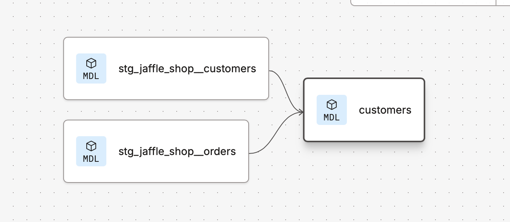

# Building Models

Added a new model ```customer.sql``` in the models repository : 

~~~~sql 
with customers as (

    select
        id as customer_id,
        first_name,
        last_name

    from raw.jaffle_shop.customers

),

orders as (

    select
        id as order_id,
        user_id as customer_id,
        order_date,
        status

    from raw.jaffle_shop.orders

),

customer_orders as (

    select
        customer_id,

        min(order_date) as first_order_date,
        max(order_date) as most_recent_order_date,
        count(order_id) as number_of_orders

    from orders

    group by 1

),


final as (

    select
        customers.customer_id,
        customers.first_name,
        customers.last_name,
        customer_orders.first_order_date,
        customer_orders.most_recent_order_date,
        coalesce(customer_orders.number_of_orders, 0) as number_of_orders

    from customers

    left join customer_orders using (customer_id)

)

select * from final
~~~~

### _MAKE SURE TO SAVE THE FILE!_ 

We should be able to preview (Table Item Bottom left) to see final view of query 

To run the sql queries in the models directory we type 

~~~
dbt run 
~~~

This will execute all the models in the models directory 

When reviewing the Logs (In the Commands section) 
There's a feature to review the details ```Debug Logs```

Note : a new *view* was created when we ran this query

~~~~sql
create or replace view analytics.dbt_eekwonna.customers
~~~~

This is due to the default materialisation (when the model doesn't specify to ```create or replace view/table```) dbt will create an object based on the yml

---
## Overriding configuration parameters

In the ```my_first_dbt_model.sql``` file a Jinja config block is specified with ```{{config(materialized='table')}}```
: 

**my_first_dbt_model.sql** 

~~~~sql
{{ config(materialized='table') }}

with source_data as (

    select 1 as id
    union all
    select null as id

)

--etc....
~~~~

---

The yml file contains all the global configuration for the project 

**dbt_projets.yml**

~~~~yml
# ...
models:
  my_new_project:
    # Applies to all files under models/example/
    example:
      +materialized: table
~~~~

If you want to override configuration you can use the configuration block in the model (Jinja)

---

If the Jinja config is modified to 

~~~~
{{config(materialized='table')}}
~~~~

### _MAKE SURE TO SAVE THE FILE!_

To run just the model by itself: 
* to the left of Build icon 
* Run model 

**dbt command line code** 
~~~~
dbt run --select my_first_dbt_model
~~~~

---

#### If Lineage is currently unavailable 

Type the name of the projects in the search and Update Graph

---

## Modularity

The concept of Modularity is breaking down data models into distinct re-usable building blocks (semantic pieces)

We can BREAK down the ```customers.sql``` into several CTEs. 

In a scenario where want to use the```customers``` (belonging to the ```customers.sql```) 

~~~~sql
-- ...
with customers as (

    select
        id as customer_id,
        first_name,
        last_name

    from raw.jaffle_shop.customers
)
-- ...
~~~~

instead of copying this down into another large SQL model we can break this down and form the dependency

We can take the logic out of the ```customers.sql``` and make it it's own model 

---

## Staging 

Note: dbt Naming conventions suggest that if producing a 1-1 model with source [schema].[object_name] becomes [schema]__[object] 
("_" underscore to replace ".")


By creating the following staging models :


**stg_jaffle_shop__customers.sql**

~~~sql
select
    id as customer_id,
    first_name,
    last_name

from raw.jaffle_shop.customers
~~~

**stg_jaffle_shop__orders.sql**

~~~~sql
select
    id as order_id,
    user_id as customer_id,
    order_date,
    status

from raw.jaffle_shop.orders
~~~~

To reference the staging models in a separate model we use the ```__ref``` function in the dbt sql script

i.e. the customers.sql script becomes 

~~~~sql 

with customers as (

select * from {{ ref('stg_jaffle_shop__customers')}}

),

orders as (

select * from {{ref('stg_jaffle_shop__orders')}}

),

customer_orders as (

    select
        customer_id,

        min(order_date) as first_order_date,
        max(order_date) as most_recent_order_date,
        count(order_id) as number_of_orders

    from orders

    group by 1

),


final as (

    select
        customers.customer_id,
        customers.first_name,
        customers.last_name,
        customer_orders.first_order_date,
        customer_orders.most_recent_order_date,
        coalesce(customer_orders.number_of_orders, 0) as number_of_orders

    from customers

    left join customer_orders using (customer_id)

)

select * from final
~~~~

This will reference the staging models in the final model. 




---

### Running Jobs based on dependencies

To run only specific