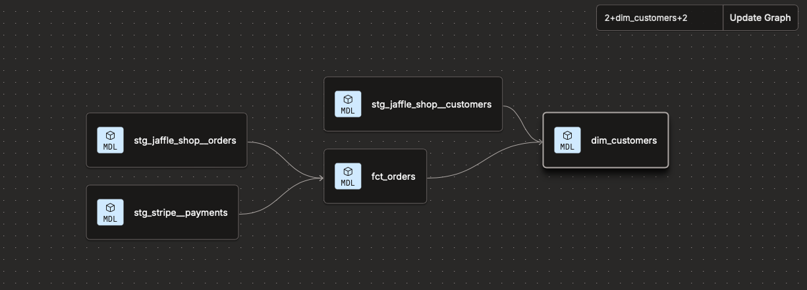
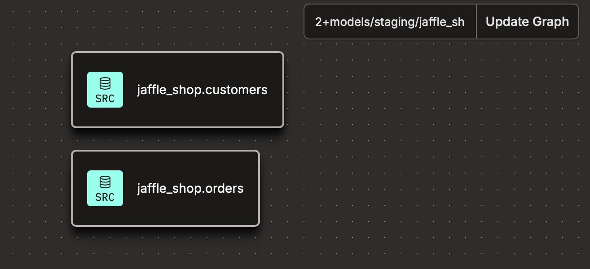
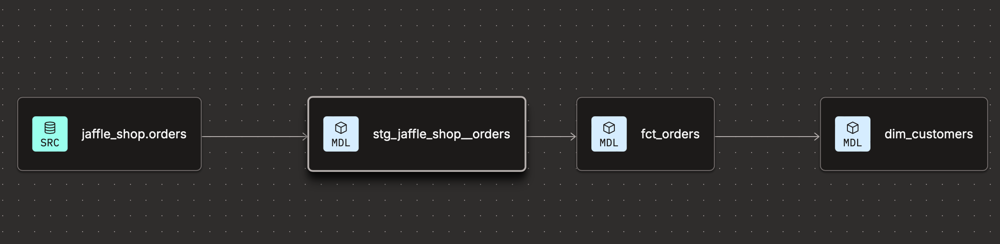
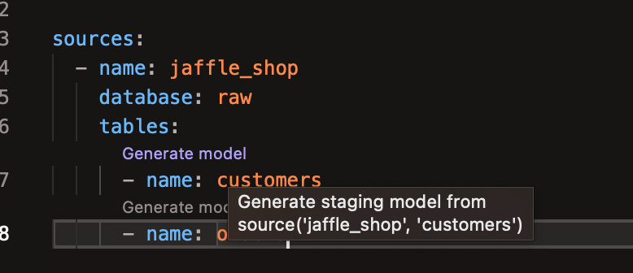

# Referencing Sources

In dbt we can utilise the `.yml` file to reference a datasource with the use of language such as 

~~~
{{source('schema_name','object_name')}}
~~~

This will create a direct reference to the data souce.

dbt will use the yml file to identify the reference of the data source. 

This means if we have several models using a specific data source. We can make the change in the yml file and dbt will compile all the models accordingly (instead of making changes manaually)

---
### Updating Staging Models 

When observing the Lineage

We can see there are 3 staging models (peforming light formatting and renaming on source data to ingest raw data)

If we take `stg_jaffle_shop_orders.sql` as an example we can see the source has been **`HARD CODED`** into the model 

**stg_jaffle_shop_orders**
~~~~sql 
    select 
        id as order_id,
        user_id as customer_id,
        order_date,
        status

    from raw.jaffle_shop.orders
~~~~

`raw.jaffle_shop.orders` is hardcoded, but it's best practice to create a source to later reference in the yml file . 

---

Create a source yml in the same staging subdirectory as the staging models : 

(Note: use of "_src" as prefix to have `yml` file at the top)

~~~~
models
    ├── marts
    │   └── ...
    └── staging
        ├── jaffle_shop
        │   ├── _src_jaffle_shop.yml
        │   ├── stg_jaffle_shop__orders.sql
        │   └── stg_jaffle_shop__customers.sql
        └── stripe
            ├── _src_stripe.yml
            └── stg_stripe_payments.sql
~~~~

for each source object we can either copy from the [developer article](https://docs.getdbt.com/docs/build/sources) (by googling: Add source to your DAG)

~~~
sources:
  - name: jaffle_shop
    database: raw  
    schema: jaffle_shop  
    tables:
      - name: orders
      - name: customers

  - name: stripe
    tables:
      - name: payments
~~~

Alternative you can type `__sources` (Note : 2 undescores) in the yml and a default preset structure will appear

---

**src_jaffle_shop.yml**
~~~~yml
sources:
  - name: jaffle_shop
    database: raw
    schema: jaffle_shop
    tables:
      - name: customers
      - name: orders
~~~~

Once created we can save and refresh Lineage we should expect the following :

**scr_stripe_payments.yml**
~~~~yaml
sources:
  - name: stripe
    database: raw
    schema: stripe
    tables:
      - name: payments
~~~~

Note: that if database and schema details are not udpated dbt will assume the same schema as the name

---

Once the source files have been set up. 
We can connect the source files in the models by using `Jinja` to : 

* `raw.jaffle_shop.orders`  &rarr; `{{source('jaffle_shop','orders')}}`

**stg_jaffle_shop_orders**
~~~~sql
    select 
        id as order_id,
        user_id as customer_id,
        order_date,
        status

    from {{source('jaffle_shop','orders')}}
~~~~

Note: `Jinja` uses the source name and table name (from the `.yml` file) 

The Lineage should update as such: 

Also it is best practice to have 1 staging model for each source. 

When clicking the `compile` (`</>` Item) we can see the compiled (with the referenced table)

---

### Maintanable 

This means that for any future migrations going forward we would ONLY have to upate the `.yaml` file to update any reference objects

---

## Source Freshness

This allows us to ensure raw data in sources is new. (We can define how fresh we want the data to be at any one time) 

dbt will check this to let us know if data is getting old 

In `_src_jaffle_shop.yml` by adding a `config` and a `__freshness` we can update the `.yml` as such 

*_src_jaffle_shop.yml**
~~~~yml
sources:
  - name: jaffle_shop
    database: raw
    schema: jaffle_shop
    tables:
      - name: customers
      - name: orders
        config:
          freshness:
            warn_after:
              count: 6
              period: hour
            error_after:
              count: 12
              period: hour
            loaded_at_field: etl_loaded_at
~~~~

^ This will test the freshness of the table and provide an alert/error accordingly 

By running 

~~~bash 
dbt source freshness
~~~

Error logs 
**WARNING**
~~~~log
13:50:06 Started source jaffle_shop.orders (external)
13:50:07 Stale [0.0s] source jaffle_shop.orders (external) (last updated 5 days 11h 27m 42s ago)
~~~~

**WARNING**
~~~~log
14:23:47 Warned [0.0s] source jaffle_shop.orders (external) (last updated 5 days 12h 1m 22s ago)
~~~~

We can see the **Stale** or **Warning** message 

---

We can also apply this at Schema level: 

*_src_jaffle_shop.yml**
~~~~yml
sources:
  - name: jaffle_shop
    database: raw
    schema: jaffle_shop
    config:
      freshness:
        warn_after:
          count: 21
          period: day
        error_after:
          count: 22
          period: day
      loaded_at_field: etl_loaded_at
    tables:
      - name: customers
        config:
          freshness: null
      - name: orders

~~~~

NOTE `customers` table doesn't contain an `etl_loaded_at` field hence freshness is udpated to null

---

## Using Codegen package 

To configure and reference several objects in the data warehouse into our `.yml` 

The codegen package can be installed from the [dbt Hub](http://hub.getdbt.com/) 

By following the instruction in the [Codegen Package](https://hub.getdbt.com/dbt-labs/codegen/latest/) site

We can see that we need to create a `.yml` in the project folder with the following : 

~~~~yml
packages:
  - package: dbt-labs/codegen
    version: 0.14.1
~~~~

(Ensuring we have dbt version between `1.1.0` and `3.0.0`) 

Run the following to install the package

~~~~bash 
dbt deps
~~~~

This will allow us to use the new macro to install. Now we can use a macro to generate all the sources. 

In the usage section we can see a line to print all the sources. 

We can run this in a new file to compile a list of all the objects linked to the source provided

~~~~
{{ codegen.generate_source(schema_name= 'jaffle_shop', database_name= 'raw') }}
~~~~

`Compile` returns 

~~~~yml
version: 2

sources:
  - name: jaffle_shop
    database: raw
    tables:
      - name: customers
      - name: orders
~~~~

This will provide all the sources that we have in our warehouse for the specified `raw` database and `jaffle_shop` schema 

We can save this in a new yml file and store this as our `_src_jaffle_shop.yml` file 

---

## Generating Staging models

Once you have the `.yml` copied from the COMPILED code from codegen. We can generate the staging models by reveiwing the `.yml`

Above each object we should have the option to generate a staging model

By default it will import a CTE and rename the metrics which can be modified accordingly. 

We can now refine the staging models with : 
1. Renaming Columns 
2. Filtering Rows (removing irrelevant/invalid records)
3. Type casting (Converting data types for consistency)
4. Basic Computations (Converting pennies(p) to pounds(£))
5. Basic Date Transformations

Dbt also provides a [Style Guide](https://docs.getdbt.com/best-practices/how-we-style/1-how-we-style-our-dbt-models) for additional support

i.e. the customer staging model then becoems 

~~~~sql 
with 

source as (

    select * from {{ source('jaffle_shop', 'orders') }}

),

renamed as (

    select
        id as order_id,
        user_id as customer_id,
        order_date,
        status as order_status,
        etl_loaded_at

    from source

)

select * from renamed

~~~~
