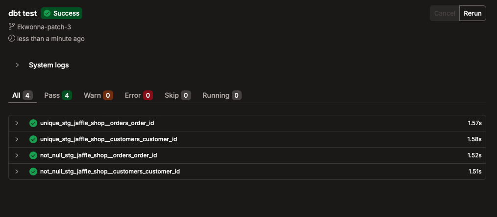
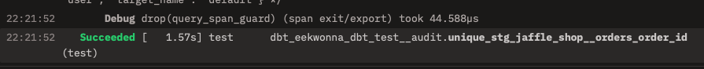

# Testing

We can apply a series of automated checks in our dbt projects. These can be scaled easily and quickly accross the entire project 

There are 2 types of testing in dbt : 
* **Generic Tests** - Re-usable tests built in dbt we can apply columns and models (ensuring column uniquess or is not null)
* **Singular Tests** - Custom tests we can write using SQL query (i.e. ensuring cusotmers total value > 0)

These can be set up in production to provide alerts

---

When you run 

~~~
dbt test
~~~

you can check all the checks are applied accross the models

## Generic Tests

Highly scalable and resuable, can be pplied to many different models and columns (defined in the `.yml` file )

1. UNIQUE - Ensures values in a columns are unique
2. NOT_NULL - No null values 
3. ACCEPTED_VALUES - Checks values belong to specified list 
4. RELATIONSHIPS - validates all values in a column can be referenced to a corresponding (parent table) primary key column (INTEGRITY)

## Singular Test

For specific one off assertions. Set up via `.sql` file stored in the `test` directory 

^ Perfect for validating business logic 

i.e. to look for duplicates we may have the following test 

~~~sql 
select count(*)
  from (select id from test_dim_table)
  group by id
  having count(*) > 1
~~~

If this returns an output we know we have failed the duplicates test and an alert can be configured. 

[Package Hub](hub.getdbt.com) contains a `dbt_utils` package which contains SQL tests that have already been configured with dbt

---

## GENERIC TEST: UNIQUE & NOT NULL 

set up a `.yml` similar to the `_src_` `.yml` but this time we set up a `_stg_` `.yml` for the model we are addressing 

~~~~
models
    ├── marts
    │   └── marketing
    │       └── dim_customers.sql
    └── staging
        ├── jaffle_shop
        │   ├── _src_jaffle_shop.yml
        │   ├── _stg_jaffle_shop.yml*
        │   ├── stg_jaffle_shop__orders.sql
        │   └── stg_jaffle_shop__customers.sql
        └── stripe
            ├── _src_stripe.yml
            └── stg_stripe_payments.sql
~~~~

Note the **`_stg_jaffle_shop.yml`** is new. 

In this `.yml` we define the model, columns and tests accordingly 

~~~~yml 
models:
  - name: stg_jaffle_shop___customers
    columns:
      - name: customer_id
        data_tests:
          - unique 
          - not_null 

  - name: stg_jaffle_shop__orderss
    columns:
      - name: order_id
        data_tests:
        - unique 
        - not_null

~~~~

Note: the **renamed** staging model columns have been used to define the metrics in the `.yml`

To run the testing we use 

~~~bash 
dbt test
~~~

This will go through our `.yml` and if successful returnt he following 

---

## GENERIC TEST: ACCEPTED VALUES 

To set up a column to only contain specific values we use the following notation 

 **`_stg_jaffle_shop.yml`** 
~~~~yml
models:
# -name: stg_jaffle_shop__customer
#        ...

  # - name: stg_jaffle_shop__orders
    columns:
      # - name: order_id
          # ...
      - name: order_status
        data_tests:
          - accepted_values:
              arguments:
                values:
                - completed
                - return_pending
                - returned
                - placed
                - shipped

~~~~

OR 

~~~~yml
      - name: order_status
        data_tests:
          - accepted_values:
              arguments:
                values: ['completed','return_pending','returned','placed','shipped']

~~~~

We can specify our tests for specific models that we want to test 

~~~~bash
dbt test --select stg_jaffle_shop__orders
~~~~

This will only run the tests associated with `jaffle_shop__orders` model

---

## GENERIC TEST: RELATIONSHIP TESTS

Use to validate every customer ID key in the `orders` model can be associated with the `customer_id` from `customers` model. We can reference with the following: 

 **`_stg_jaffle_shop.yml`** 
~~~~yml
models:
- name: stg_jaffle_shop__customers
  columns:
    - name: customer_id
      data_tests:
        - not_null
        - unique
#        ...
- name: stg_jaffle_shop__orders
  columns:
      # - name: order_id
      # - name: order_status
      - name: customer_id
        data_tests:
          - relationships:
              arguments:
                to: ref('stg_jaffle_shop__customers')
                field: customer_id

~~~~

Note: dbt update notes now requires usse of `arguements` before the `field` and `to` parameters.

## SINGULAR TESTS

For singular tests remember the `dbt test` command:  
! **FAILS** ! if query returns any rows

So our goal is to create a query that **VIOLATES** our understanding. 

---

Reviewing the **stg_stripe_payments** model we can see there are rows for the same `order_id` where 2 succesful payments add to a specific total . 

| payment_id| order_id | payment_method| status| payment_amount |
| :--- | :--- | :--- | :--- | :--- | 
| 1 | 1| credit_card | Success | 10000 | 
| 2 | 2| bank_transfer | Success | 20000 | 
| 3 | 3| coupon| Success | 100 | 
| 4 | 4| bank_transfer | Fail | 1700 | 
| 5 | 4| bank_transfer | Success | 1700 | 
| 6 | 5| bank_transfer | Success | 20000 | 
| 7 | 6| credit_card | Success | 100 | 
| 8 | 7| credit_card | Fail | 1700 | 
| 9 | 7| bank_transfer | Success | 1700 | 
| 10 | 7| bank_transfer | Success | 20000 | 
| 11 | 8| credit_card | Success | 100 | 
| 12 | 9| coupon | Fail | 1700 | 
| 13 | 10| bank_transfer | Success | 1700 | 

For examples `order_id` : ( 7 ,4 )

We can see several transactions wen through to add to a particular total. We want to ensure the sum of all payments for an order is not negative. 

To set up the generic tesst we first need tos et up a `.sql` file for our test. 

in the test directory : 

~~~~
├── models
│   ├── marts/
│   └── staging/
│       ├── jaffle_shop/
│       └── stripe/
└── test/
    └── *assert_stg_stripe__payments_total_positive.sql
~~~~

Ensure the title is clear on what the file will include. 

In the example where we want the sum of amount to be less than 0 we want to test for negative total amounts : 

**assert_stg_stripe__payments_total_positive.sql**
~~~~sql 
select 
    order_id, 
    sum(payment_amount)
from {{ ref('stg_stripe__payments') }}
group by order_id
having sum(payment_amount) < 0 
~~~~

*Note: we renamed `amount` as `payment_amount` in the staging model so will need to referene the renamed metric. 

any models in the test directory should run as they've been referenced in the `dbt_project.yml' using 

~~~yml 
test-paths: ["tests"]
~~~

---
