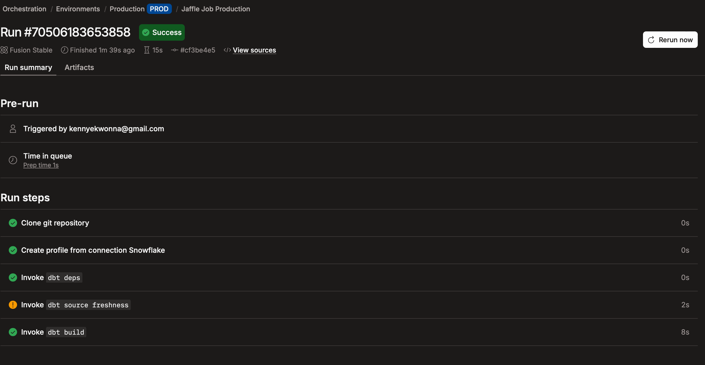
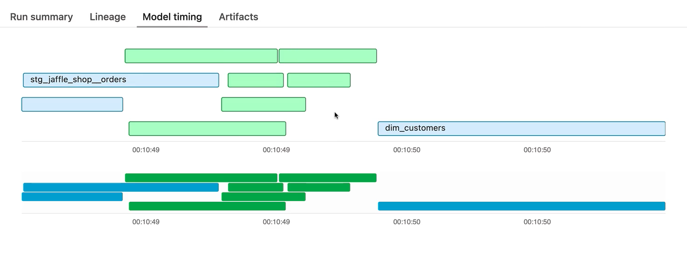

# Documentation

We can document a project at 3 levels: 
1. Model Level -  High level description for table or views
2. Source Level - Document raw source tables 
3. Column Level - Description for each individual field

---

### Writing Documentation 

We can add the documentation in the `.yml` files : 

**`_stg_jaffle_shop.yml`**

~~~~yml
models: 
  - name : stg_jaffle_shop__customers
    description : The grain of this table is one unique customer per row 
    columns:
      - name: customer_id
        description : Primary key for the customers table
        data_tests:
        - unique
        - not_null 
  - name: stg_jaffle_shop__orders
    description : One order per row
    columns: 
    - name: order_id
      description: Primary key for the orders table
      data_tests: 
      - unique
      - not_null 

~~~~

### Writing Doc Blocks

In order to keey our `.yml` file clean we can reference a larger text file (saved as an `.md` file) 

~~~~
models
    ├── marts/
    │   └── ...
    └── staging
        ├── jaffle_shop
        │   ├── *jaffle_shop_docs.md
        │   └── ...
        └── stripe/
~~~~

We would store the information in the md using the `` notation. 

**jaffle_shop_docs.md**
~~~~md

    
One of the following values: 

| status         | definition                                       |
|----------------|--------------------------------------------------|
| placed         | Order placed, not yet shipped                    |
| shipped        | Order has been shipped, not yet been delivered   |
| completed      | Order has been received by customers             |
| return pending | Customer indicated they want to return this item |
| returned       | Item has been returned                           |



~~~~

To reference this in the `.yml` file we us quote notation 

**`_stg_jaffle_shop.yml`**

~~~~yml
models: 
  - name : stg_jaffle_shop__customers
    # ...
  - name: stg_jaffle_shop__orders
    description : One order per row
    columns : 
    - name : order_id
    - name : ordr_status
      description: "{{ doc('order_status') }}"
      data_tests:
      - accepted_values:
        values: 
        # ...

~~~~

---

It is good best practice to define raw data sources and clarifying ambigious columns and metrics. 

**_src_jaffle_shop.yml**
~~~~yml 

sources:
  - name: jaffle_shop
    database: raw
    schema: jaffle_shop
    description: A clone of a Postgres application database
    # config: ...
    tables:
      - name: customers
        description : Raw customer datga
        columns:
        - name : id
          description: Primary key for our customers data
      - name: orders
        description : Raw orders data
        columns:
          name: id
          description : Primary key for order data

~~~~

Note when documenting any metrics from the source ensure the column names are associated with the raw data columns

---

If using DBT Copilot to generate documentation. Remember to always review the results. 

You can request Dbt Copilot to `generate documentation` this will udpate the description to the `.yml` files associated with the sources and models. 

NOTE: ALWAYS REVIEW THE PROVIDED DESCRIPTIONS PROVIDED BY COPILOT 

Copilot is a good tool for starting off. 

Copilot will also carry over all the column names so there's no need to investigate and add them to the `.yml` one by one 

---

### Merging to Main

Before merging any brances to main it's good practice to perform a final check to ensure the branch is polished. We do this with the following : 

1. Sources are configured `_scr_[project].yml` files 
2. Written descriptions for our sources, models and columns (provided in the `_stg_[project].yml`)
3. these should include `descriptions` and `data_tests`
4. Staging Models refactores with an import CTE (from the source) 
5. Models located in appropriate folder (i.e. `marts/[sub_group_directory]`)
6.  `.yml` files associated with each models (located in the same folder as the model) for added testing and descriptions

Once tested and satisfied, you can `Merge to Main branch` domain

---

# Deployment

We use the main branch for building models. 
Use Development models to test and develop the next set of models. Once Deployed and merged to Main the model should update the next schedueled run. 

---

### Set up a Deployment Environment 

2 Different Type of Environments : 

1. Development Environment Type  (you can only have one) 
2. Deployment Environment Type  There are different types of deployment types (General, Staging, Production)

You can specify which branch to run projects in the Environment. (Default is main)

We can set up the Connection from the established connections.

We can assign a profile using key value pairs. 

(Review `ConfigureSnowflake2dbt.md` for details on assigning publick rsa keys to profiles to embed the connection)

***NOTE*** : When deploying a real dbt Project, you should set up a separate data warehouse account for this run. This should not be the same account that you personally use in development.

***IMPORTANT*** : The schema used in production should be different from anyone's development schema.

---

### Schedule a job on dbt 

In the example we want to build a daily build on the entire model 

We can `deploy a job` associated to the `Production` environment

* Select `Run source freshness`
* Specify the models we want to run using dbt commands to build the whole project regularly with the command: 

~~~~bash 
dbt build
~~~~

Execution Settings 

We can schedule the run indicating **Intervals**/**Specific Time** or [**Cron schedule**](https://crontab.guru)

We can also trigger the job using **Job Completion**
(i.e. when a separate job has been successfully completed or failed )

We can also review the model Timings : 

And if necessary we can `rerun` from  the start of the job or a point of failure. 

---

### dbt Catalog 

This allows us to dive into the metadata and details behind the Project. 

Model details, Lineage, Test details and recommendations. We can assess the recommendations that are inbuilt with dbt. 

dbt Catalog also provides metrics on Model Run times and Model usage across the project. 